MACS 30200 PS3
================
Erin M. Ochoa
2017 May 15

-   [Regression diagnostics](#regression-diagnostics)
    -   [Testing for unsual and/or influential observations](#testing-for-unsual-andor-influential-observations)
        -   [High-leverage observations](#high-leverage-observations)
        -   [Discrepant residuals](#discrepant-residuals)
        -   [Influential observations](#influential-observations)
        -   [Next steps](#next-steps)
    -   [Non-normally distributed errors](#non-normally-distributed-errors)
        -   [Next steps](#next-steps-1)
    -   [Heteroscedasticity](#heteroscedasticity)
    -   [Multicollinearity](#multicollinearity)
-   [Interaction terms](#interaction-terms)
    -   [Marginal effect of age on warmth, conditional on education](#marginal-effect-of-age-on-warmth-conditional-on-education)
    -   [Marginal effect of education on warmth, conditional on age](#marginal-effect-of-education-on-warmth-conditional-on-age)
-   [Missing data](#missing-data)

Regression diagnostics
======================

Estimate the following linear regression model of attitudes towards Joseph Biden:

*Y* = *β*<sub>0</sub> + *β*<sub>1</sub>*X*<sub>1</sub> + *β*<sub>2</sub>*X*<sub>2</sub> + *β*<sub>3</sub>*X*<sub>3</sub>
 where *Y* is the Joe Biden feeling thermometer, *X*<sub>1</sub> is age, *X*<sub>2</sub> is gender, and *X*<sub>3</sub> is education. Report the parameters and standard errors.

``` r
df = read.csv('biden.csv')

df$Gender = factor(df$female, labels=c('Man','Woman'))

df$Party[df$dem == 1] = 'Democrat'
df$Party[df$dem == 0 & df$rep == 0] = 'No Affiliation'
df$Party[df$rep == 1] = 'Republican'

df = na.omit(df)

lm_biden = lm(biden ~ age + Gender + educ, df)

summary(lm_biden)
```

    ## 
    ## Call:
    ## lm(formula = biden ~ age + Gender + educ, data = df)
    ## 
    ## Residuals:
    ##    Min     1Q Median     3Q    Max 
    ##  -67.1  -14.7    0.7   18.9   45.1 
    ## 
    ## Coefficients:
    ##             Estimate Std. Error t value Pr(>|t|)    
    ## (Intercept)  68.6210     3.5960   19.08  < 2e-16 ***
    ## age           0.0419     0.0325    1.29      0.2    
    ## GenderWoman   6.1961     1.0967    5.65  1.9e-08 ***
    ## educ         -0.8887     0.2247   -3.96  7.9e-05 ***
    ## ---
    ## Signif. codes:  0 '***' 0.001 '**' 0.01 '*' 0.05 '.' 0.1 ' ' 1
    ## 
    ## Residual standard error: 23.2 on 1803 degrees of freedom
    ## Multiple R-squared:  0.0272, Adjusted R-squared:  0.0256 
    ## F-statistic: 16.8 on 3 and 1803 DF,  p-value: 8.88e-11

``` r
biden_augment = df %>%
                mutate(hat = hatvalues(lm_biden),
                student = rstudent(lm_biden),
                cooksd = cooks.distance(lm_biden))
```

The y-intercept has a coefficient of 68.621 and a standard error of 3.596; it is statistically significant at the p&lt;.001 level. *X*<sub>1</sub> (age) has a coefficient of 0.042 and a standard error of 0.032; it is not statistically significant (p=0.198). *X*<sub>2</sub> (female) has a coefficient of 6.196 and a standard error of 1.097; it is statistically significant at the p&lt;.001 level. *X*<sub>3</sub> (education) has a coefficient of -0.889 and a standard error of 0.225; it is also statistically significant at the p&lt;.001 level.

Testing for unsual and/or influential observations
--------------------------------------------------

### High-leverage observations

First, we plot high-leverage observations (those with a leverage value greater than twice the average leverage value):

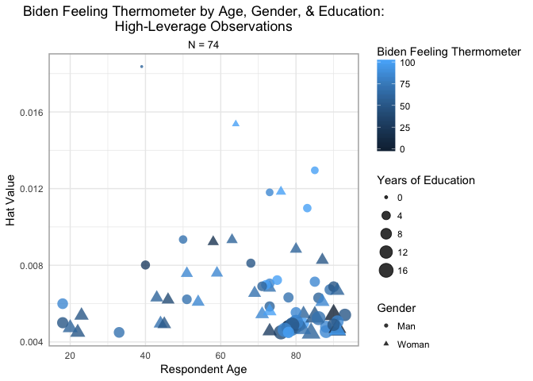

We can see that most of the high-leverage observations are of higher feeling-thermometer values from older respondents of both genders and with more years of schooling. The two points with the highest leverage values, however, are from respodents with lower levels of education.

### Discrepant residuals

Next, we plot discrepant residuals (those with an absolute value greater than 2):

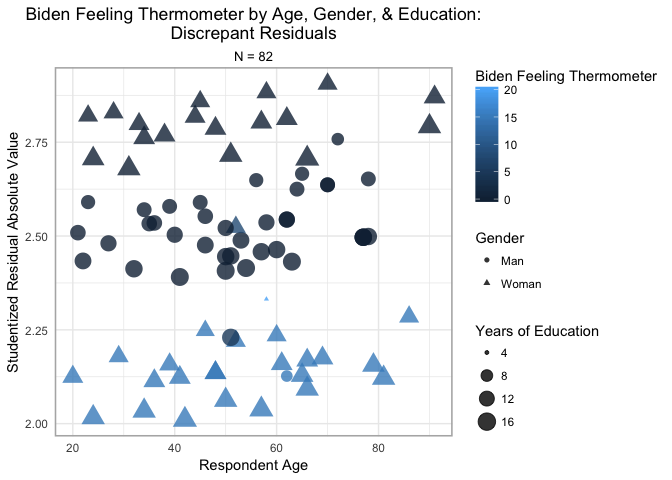

We see that most discrepant residuals are from respondents with higher levels of education, but that they vary in age and gender. Interestingly, those with lower absolute residual values (relative to the discrepant residuals) tend to be women with higher scores for Biden warmth, while those with average and high residual values (again, relative to the discrepant residuals) tend to be men and women, respectively, with low Biden warmth scores.

### Influential observations

We now plot influential observations (those with high Cook's D values):

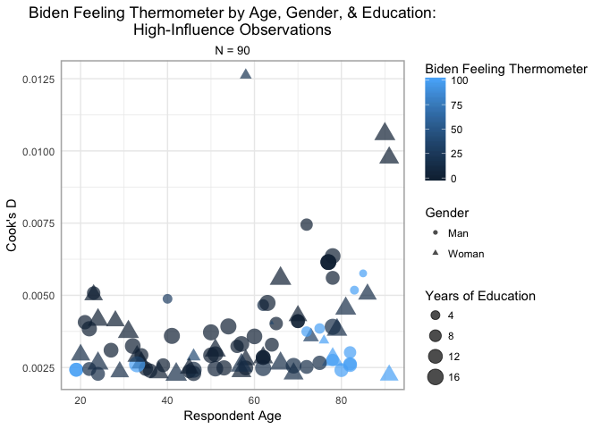

We can see that the respondents vary by age and gender, but that most have low values for Biden warmth and and moderate to high education.

We plot all the unusual observations together, with residuals versus leverage and colored by Cook's D:

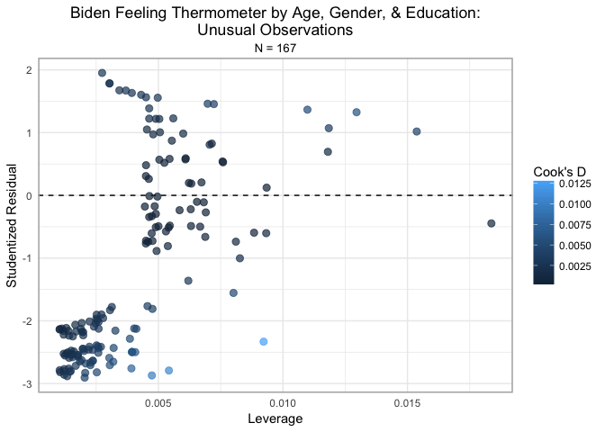

We see that the observations with mid-level Cook's D values are concentrated in the lower left corner of the plot; these points have low leverage and negative studentized residuals of high distance.

Next, we create histograms of the outliers compared to all the observations:

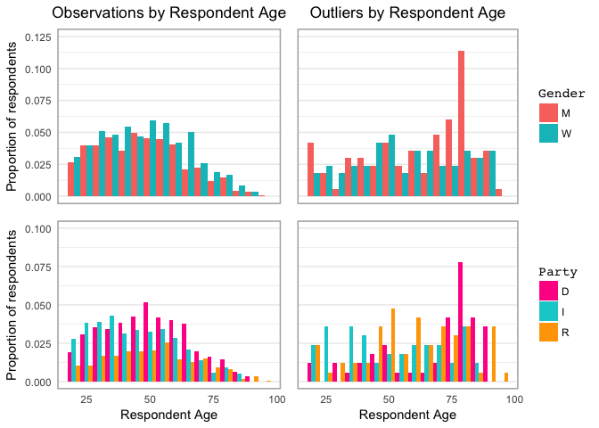

We see that respondents of advanced age, particularly men, are overrepresented among the outliers. Additionally, older respondents from all parties and middle-aged Republicans are overrepresented among the outliers.

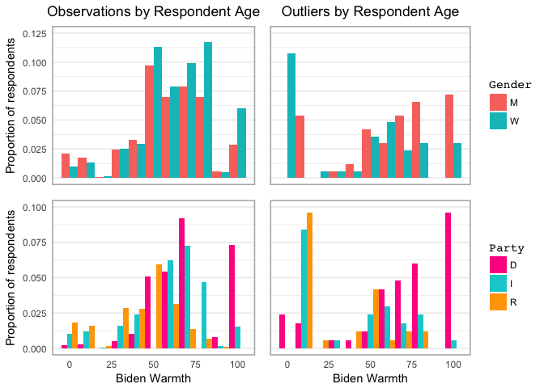

We see that women with very low warmth scores and men with very high warmth scores are overrepresented among the outliers, as are Independents and Republicans with very low warmth scores.

Next, we visualize the outliers alone, with Biden warmth versus respondent age, colored by party and shaped by gender:

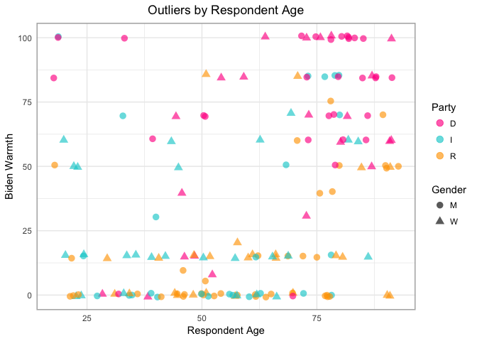

As indicated by the histograms above, we see that mast of the outliers with very high warmth scores are senior respondents of both genders who identify as Democrats. Most of the outliers with low warmth scores identify as Republicans or Independents, span the full range of ages, and vary by gender.

### Next steps

If we were moving forward with this research, we would run the model without the unusual observations and compare the results with those generated from the model that uses all the observations. We would also consider adding political party to the model because it seems to have an effect on Biden warmth scores, at least among outliers and potentially among the rest of the observations. Finally, we would consider adding one or more interaction terms to the model because older Democrats and older men are overrepresented among the outliers; adding such interaction terms could help explain the relationship between those variables.

Non-normally distributed errors
-------------------------------

First, we generate a Q–Q plot:

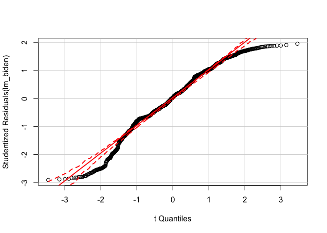

Many of the observations, particularly those in the S-shape at the tail ends of the distribution, fall outside the confidence bands. This indicates that the errors are not normally distributed.

To confirm this, we generate a density plot of the studentized residuals:

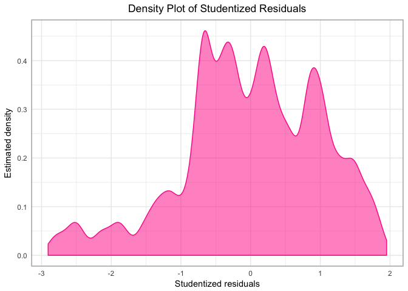

The very heavy left skew and multiple peaks confirm that the residuals are not normally distributed.

### Next steps

To correct this, we could use a power or log transformation on one or more of the continuous variables (age and Biden warmth). As with outliers above, we could also considering adding party and/or interaction terms to the model.

Heteroscedasticity
------------------

We evaluate the plot of residuals versus predicted warmth in order to assess homoscedasticity:

``` r
biden_augment %>%
  add_predictions(lm_biden) %>%
  add_residuals(lm_biden) %>%
  ggplot(aes(pred, resid)) +
  geom_point(alpha = .2, color='darkturquoise') +
  geom_hline(yintercept = 0, linetype = 2) +
  geom_quantile(method = "rqss", lambda = 5, quantiles = c(.05, .95), color='deeppink', size=1) +
  labs(title = "Variance of Error Terms",
       x = "Predicted Warmth",
       y = "Residuals") +
  theme(plot.title = element_text(hjust = 0.5),
        panel.border = element_rect(linetype = "solid", color = "grey70", fill=NA, size=1.1))
```

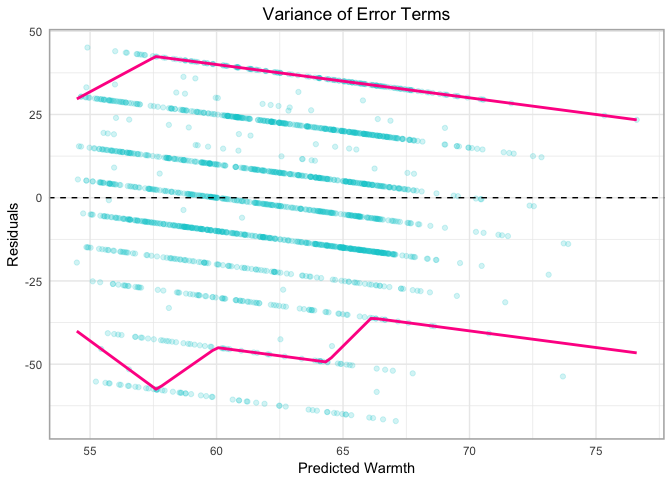

The confidence bands do not resemble horizontal lines, indicating that the errors have non-constant variance. This is particularly true for residuals with low-to-medium predicted warmth. We conduct a Breusch-Pagan test to formally assess homoscedasticity:

``` r
bptest(lm_biden)
```

    ## 
    ##  studentized Breusch-Pagan test
    ## 
    ## data:  lm_biden
    ## BP = 20, df = 3, p-value = 5e-05

The null hypothesis for the Breusch-Pagan test is that the errors have constant variance. With a p-value &lt; .001, we reject the null hypothesis and find that the errors do exhibit heteroscedasticity.

This has implications for inference because non-constant variance in the error terms can artificially augment or diminish the standard errors; this could then influence the t-statistics and accompanying p-values for different coefficients, perhaps leading us to falsely identify a variable as statistically significant when it is not, or, conversely, fail to identify a variable as statistically significant when it is indeed so.

Multicollinearity
-----------------

Finally, we test for multicollinarity with a correlation heatmap:

``` r
#Adapted slightly from code by bsoltoff
cormat_heatmap = function(data){
  # generate correlation matrix
  cormat = round(cor(data), 2)
  
  # melt into a tidy table
  get_upper_tri = function(cormat){
    cormat[lower.tri(cormat)] = NA
    return(cormat)
  }
  
  upper_tri = get_upper_tri(cormat)
  
  # reorder matrix based on coefficient value
  reorder_cormat = function(cormat){
    # Use correlation between variables as distance
    dd = as.dist((1-cormat)/2)
    hc = hclust(dd)
    cormat <-cormat[hc$order, hc$order]
  }
  
  cormat = reorder_cormat(cormat)
  upper_tri = get_upper_tri(cormat)
  
  # Melt the correlation matrix
  melted_cormat = reshape2::melt(upper_tri, na.rm = TRUE)
  
  # Create a ggheatmap
  ggheatmap = ggplot(melted_cormat, aes(Var2, Var1, fill = value))+
    geom_tile(color = "white")+
    scale_fill_gradient2(low = "darkturquoise", high = "deeppink", mid = "white", 
                         midpoint = 0, limit = c(-1,1), space = "Lab", 
                         name="Pearson\nCorrelation") +
    theme_minimal()+ # minimal theme
    theme(axis.text.x = element_text(angle = 45, vjust = 1, 
                                     size = 12, hjust = 1))+
    coord_fixed()
  
  # add correlation values to graph
  ggheatmap + 
    geom_text(aes(Var2, Var1, label = value), color = "black", size = 4) +
    theme(
      axis.title.x = element_blank(),
      axis.title.y = element_blank(),
      panel.grid.major = element_blank(),
      panel.border = element_blank(),
      panel.background = element_blank(),
      axis.ticks = element_blank(),
      legend.position = "bottom",
      plot.title = element_text(hjust = 0.5)) +
    labs(title='Correlation Heatmap')
}

cormat_heatmap(select_if(df, is.numeric))
```

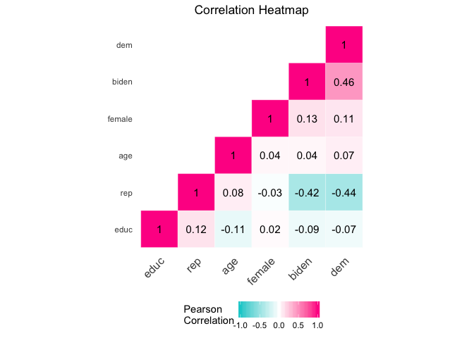

While we see that warmth score and Democrat are moderately negatively correlated with Republican, and that Democrat is moderately correlated with warmth score, no two independent variables are moderately or strongly correlated with one another. This indicates that multicollinearity is not a problem in this model.

We confirm this by calculating variance inflation factors (VIF) for the variables in the regression model:

``` r
vif(lm_biden)
```

    ##    age Gender   educ 
    ##   1.01   1.00   1.01

The VIF statistics are all below 10, which confirms that multicollinearity is not a concern here.

Interaction terms
=================

Estimate the following linear regression model:

*Y* = *β*<sub>0</sub> + *β*<sub>1</sub>*X*<sub>1</sub> + *β*<sub>2</sub>*X*<sub>2</sub> + *β*<sub>3</sub>*X*<sub>1</sub>*X*<sub>2</sub>

where *Y* is the Joe Biden feeling thermometer, *X*<sub>1</sub> is age, and *X*<sub>2</sub> is education. Report the parameters and standard errors.

``` r
lm_int_biden = lm(biden ~ age + educ + age*educ, df)

summary(lm_int_biden)
```

    ## 
    ## Call:
    ## lm(formula = biden ~ age + educ + age * educ, data = df)
    ## 
    ## Residuals:
    ##    Min     1Q Median     3Q    Max 
    ## -70.54 -12.24  -0.94  20.50  44.74 
    ## 
    ## Coefficients:
    ##             Estimate Std. Error t value Pr(>|t|)    
    ## (Intercept)  38.3735     9.5636    4.01  6.3e-05 ***
    ## age           0.6719     0.1705    3.94  8.4e-05 ***
    ## educ          1.6574     0.7140    2.32    2e-02 *  
    ## age:educ     -0.0480     0.0129   -3.72    2e-04 ***
    ## ---
    ## Signif. codes:  0 '***' 0.001 '**' 0.01 '*' 0.05 '.' 0.1 ' ' 1
    ## 
    ## Residual standard error: 23.3 on 1803 degrees of freedom
    ## Multiple R-squared:  0.0176, Adjusted R-squared:  0.0159 
    ## F-statistic: 10.7 on 3 and 1803 DF,  p-value: 5.37e-07

The y-intercept has a coefficient of 68.621 and a standard error of 3.596; it is statistically significant at the p&lt;.001 level. *X*<sub>1</sub> (age) has a coefficient of 0.042 and a standard error of 0.032; it is statistically significant at the p&lt;.001 level. *X*<sub>2</sub> (education) has a coefficient of 6.196 and a standard error of 1.097; it is statistically significant at the p&lt;.05 level. *X*<sub>1</sub>*X*<sub>2</sub> has a coefficient of -0.889 and a standard error of 0.225; it is statistically significant at the p&lt;.001 level.

### Marginal effect of age on warmth, conditional on education

``` r
#Code by bsoltoff
instant_effect = function(model, mod_var){
  # get interaction term name
  int.name = names(model$coefficients)[[which(str_detect(names(model$coefficients), ":"))]]
  
  marg_var = str_split(int.name, ":")[[1]][[which(str_split(int.name, ":")[[1]] != mod_var)]]
  
  # store coefficients and covariance matrix
  beta.hat = coef(model)
  cov = vcov(model)
  
  # possible set of values for mod_var
  if(class(model)[[1]] == "lm"){
    z <- seq(min(model$model[[mod_var]]), max(model$model[[mod_var]]))
  } else {
    z = seq(min(model$data[[mod_var]]), max(model$data[[mod_var]]))
  }
  
  # calculate instantaneous effect
  dy.dx = beta.hat[[marg_var]] + beta.hat[[int.name]] * z
  
  # calculate standard errors for instantaeous effect
  se.dy.dx = sqrt(cov[marg_var, marg_var] +
                     z^2 * cov[int.name, int.name] +
                     2 * z * cov[marg_var, int.name])
  
  # combine into data frame
  data_frame(z = z,
             dy.dx = dy.dx,
             se = se.dy.dx)
}
```

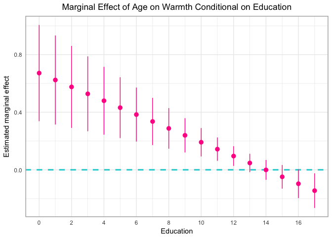

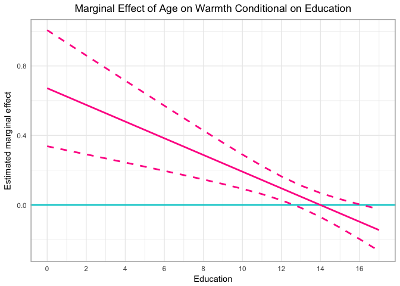

We see that the 95% confidence interval for the marginal effect of age conditional on education includes zero for education values ranging from 13 to 16; below 13, it is strictly positive, and above 16, it is strictly negative. The confidence interval is wide for values at the left tail of the distribution and much narrower for education values in the \[12,14\] range; this reflects the number of observations with values in those ranges: There are few respondents with education level below 10, and the interval widens considerably as we move left from there. There are many respondents with education level ranging from \[12,14\], so this tightens the interval; it widens as we move to 15 and above.

The plot shows that as education increases from \[0,14), age has a positive marginal effect on warmth. For education = 14, age has no marginal effect on warmth. As education increases from (14,17\], age has a negative marginal effect on warmth.

Next, we test whether the maringal effect of age conditional on education is statistically significant:

``` r
age_marginal = coef(lm_int_biden)[["age"]] + coef(lm_int_biden)[["age:educ"]]

linearHypothesis(lm_int_biden, "age + age:educ")
```

    ## Linear hypothesis test
    ## 
    ## Hypothesis:
    ## age  + age:educ = 0
    ## 
    ## Model 1: restricted model
    ## Model 2: biden ~ age + educ + age * educ
    ## 
    ##   Res.Df    RSS Df Sum of Sq    F Pr(>F)    
    ## 1   1804 985149                             
    ## 2   1803 976688  1      8461 15.6  8e-05 ***
    ## ---
    ## Signif. codes:  0 '***' 0.001 '**' 0.01 '*' 0.05 '.' 0.1 ' ' 1

We find that the marginal effect of age conditional on education (0.624) is statistically significant at the p&lt;.001 level.

### Marginal effect of education on warmth, conditional on age

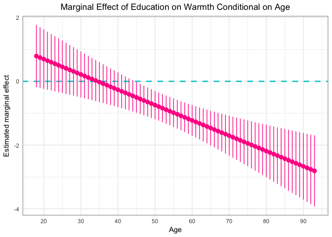

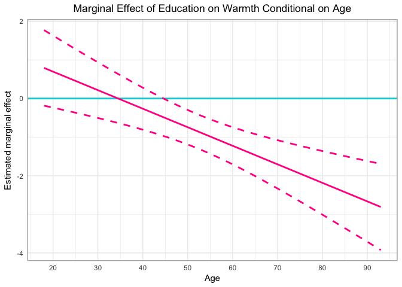

We see that the 95% confidence interval is wider at the tails and narrower between \[45,65\]; this is because there are fewer respondents with ages at the tails of the age distribution and more with ages toward the center of the distribution. The interval includes zero for ages below 45. As age increases, the marginal effect of education on warmth conditional on age decreases.

``` r
education_marginal = coef(lm_int_biden)[["educ"]] + coef(lm_int_biden)[["age:educ"]]

linearHypothesis(lm_int_biden, "educ + age:educ")
```

    ## Linear hypothesis test
    ## 
    ## Hypothesis:
    ## educ  + age:educ = 0
    ## 
    ## Model 1: restricted model
    ## Model 2: biden ~ age + educ + age * educ
    ## 
    ##   Res.Df    RSS Df Sum of Sq    F Pr(>F)  
    ## 1   1804 979537                           
    ## 2   1803 976688  1      2849 5.26  0.022 *
    ## ---
    ## Signif. codes:  0 '***' 0.001 '**' 0.01 '*' 0.05 '.' 0.1 ' ' 1

We find that the marginal effect of education on warmth conditional on age (1.609) is statistically significant at the p&lt;.05 level.

Missing data
============

Estimate the following linear regression model of attitudes towards Joseph Biden:

*Y* = *β*<sub>0</sub> + *β*<sub>1</sub>*X*<sub>1</sub> + *β*<sub>2</sub>*X*<sub>2</sub> + *β*<sub>3</sub>*X*<sub>3</sub>

where *Y* is the Joe Biden feeling thermometer, *X*<sub>1</sub> is age, *X*<sub>2</sub> is gender, and *X*<sub>3</sub> is education. This time, use multiple imputation to account for the missingness in the data. Consider the multivariate normality assumption and transform any variables as you see fit for the imputation stage. Calculate appropriate estimates of the parameters and the standard errors and explain how the results differ from the original, non-imputed model.

``` r
df2 = read.csv('biden.csv')

biden_subset_vars = df2 %>%
                    select(biden, age, educ)
```

We begin by visually assessing normality with a scatterplot matrix:

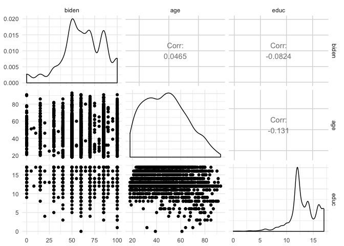

The density plots indicate that the continuous variables are not normally distributed. We continue by assessing normality formally with the Anderson-Darling test:

``` r
ad.test(biden_subset_vars$biden)
```

    ## 
    ##  Anderson-Darling normality test
    ## 
    ## data:  biden_subset_vars$biden
    ## A = 30, p-value <2e-16

``` r
ad.test(biden_subset_vars$age)
```

    ## 
    ##  Anderson-Darling normality test
    ## 
    ## data:  biden_subset_vars$age
    ## A = 10, p-value <2e-16

``` r
ad.test(biden_subset_vars$educ)
```

    ## 
    ##  Anderson-Darling normality test
    ## 
    ## data:  biden_subset_vars$educ
    ## A = 50, p-value <2e-16

For all three continuous variables, the Anderson-Darling test rejects the null hypothesis that the data are distributed normally. The test results imply that multivariate normality is out of the question; nevertheless, for the sake of completeness, we continue with formal multivariate normality tests:

``` r
mardiaTest(biden_subset_vars)
```

    ##    Mardia's Multivariate Normality Test 
    ## --------------------------------------- 
    ##    data : biden_subset_vars 
    ## 
    ##    g1p            : 1.03 
    ##    chi.skew       : 313 
    ##    p.value.skew   : 3.42e-61 
    ## 
    ##    g2p            : 16.1 
    ##    z.kurtosis     : 4.26 
    ##    p.value.kurt   : 2.06e-05 
    ## 
    ##    chi.small.skew : 313 
    ##    p.value.small  : 2.35e-61 
    ## 
    ##    Result          : Data are not multivariate normal. 
    ## ---------------------------------------

``` r
hzTest(biden_subset_vars)
```

    ##   Henze-Zirkler's Multivariate Normality Test 
    ## --------------------------------------------- 
    ##   data : biden_subset_vars 
    ## 
    ##   HZ      : 8 
    ##   p-value : 0 
    ## 
    ##   Result  : Data are not multivariate normal. 
    ## ---------------------------------------------

Both the Mardia and Henze-Zirkler tests indicate that the data are not multivariate normal.

We proceed by transforming the variables in an effort to impose a normal distribution. First, we take the log; then, we take the square root:

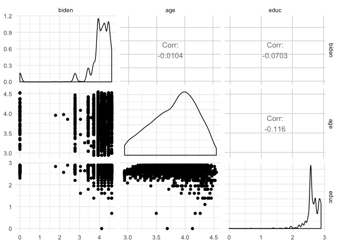

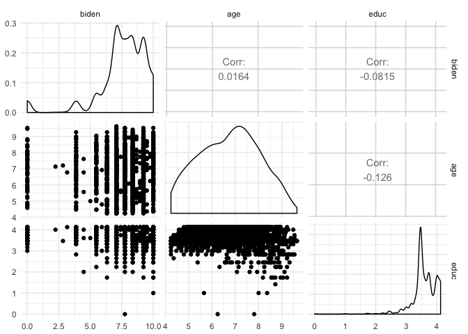

We decide that while far from perfect, the best transformations (of the ones we tried) are as follows:

—Biden feeling thermometer: ln(biden)

—Age: sqrt(age)

—Education: sqrt(education)

We transform the variables thus:

``` r
df2_transformed = df2 %>% mutate(biden = log(biden + 1),
                                 age = sqrt(age),
                                 edu = sqrt(educ))

transformed_subset_vars = df2_transformed %>%
                             select(biden, age, edu)
```

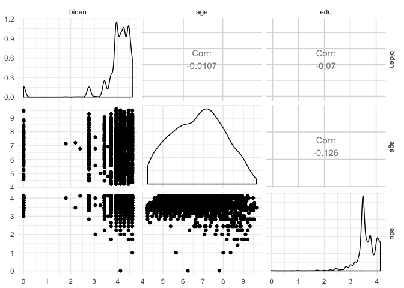

``` r
mardiaTest(transformed_subset_vars)
```

    ##    Mardia's Multivariate Normality Test 
    ## --------------------------------------- 
    ##    data : transformed_subset_vars 
    ## 
    ##    g1p            : 16.9 
    ##    chi.skew       : 5147 
    ##    p.value.skew   : 0 
    ## 
    ##    g2p            : 38.4 
    ##    z.kurtosis     : 91.3 
    ##    p.value.kurt   : 0 
    ## 
    ##    chi.small.skew : 5160 
    ##    p.value.small  : 0 
    ## 
    ##    Result          : Data are not multivariate normal. 
    ## ---------------------------------------

``` r
hzTest(transformed_subset_vars)
```

    ##   Henze-Zirkler's Multivariate Normality Test 
    ## --------------------------------------------- 
    ##   data : transformed_subset_vars 
    ## 
    ##   HZ      : 35 
    ##   p-value : 0 
    ## 
    ##   Result  : Data are not multivariate normal. 
    ## ---------------------------------------------

Despite our efforts, the data are still not multivariate normal. Nevertheless, we press on. We estimate three models:

—One with listwise deletion

—A second with full imputation

—A third with imputation based on the transformed variables

``` r
lm_listwise = lm(biden ~ age + female + educ, df2)
amelia_full = amelia(df2, noms = c('female','dem','rep'), m=5, p2s=0)
amelia_transformed = amelia(df2, logs = c('biden'), sqrt = c('age','educ'), noms = c('female','dem','rep'), m=5, p2s=0)

#Code by bsoltoff
models_imp_full = data_frame(data = amelia_full$imputations) %>%
  mutate(model = map(data, ~ lm(biden ~ age +
                                  female + educ,
                                data = .x)),
         coef = map(model, tidy)) %>%
  unnest(coef, .id = "id")
models_imp_full
```

    ## # A tibble: 20 × 6
    ##       id        term estimate std.error statistic   p.value
    ##    <chr>       <chr>    <dbl>     <dbl>     <dbl>     <dbl>
    ## 1   imp1 (Intercept)  66.7838    2.9823     22.39 1.03e-100
    ## 2   imp1         age   0.0380    0.0278      1.37  1.72e-01
    ## 3   imp1      female   6.4760    0.9657      6.71  2.51e-11
    ## 4   imp1        educ  -0.7781    0.1855     -4.19  2.83e-05
    ## 5   imp2 (Intercept)  67.1322    2.9975     22.40 9.83e-101
    ## 6   imp2         age   0.0452    0.0279      1.62  1.05e-01
    ## 7   imp2      female   5.0218    0.9677      5.19  2.29e-07
    ## 8   imp2        educ  -0.7588    0.1862     -4.08  4.75e-05
    ## 9   imp3 (Intercept)  65.4360    3.0300     21.60  2.13e-94
    ## 10  imp3         age   0.0525    0.0281      1.87  6.17e-02
    ## 11  imp3      female   5.7288    0.9766      5.87  5.10e-09
    ## 12  imp3        educ  -0.6731    0.1882     -3.58  3.55e-04
    ## 13  imp4 (Intercept)  63.7286    3.0085     21.18  3.48e-91
    ## 14  imp4         age   0.0552    0.0279      1.98  4.79e-02
    ## 15  imp4      female   5.1939    0.9695      5.36  9.30e-08
    ## 16  imp4        educ  -0.5677    0.1870     -3.04  2.42e-03
    ## 17  imp5 (Intercept)  65.0502    3.0146     21.58  2.92e-94
    ## 18  imp5         age   0.0514    0.0279      1.84  6.52e-02
    ## 19  imp5      female   5.7582    0.9706      5.93  3.43e-09
    ## 20  imp5        educ  -0.6793    0.1872     -3.63  2.91e-04

``` r
models_imp_transformed = data_frame(data = amelia_transformed$imputations) %>%
  mutate(model = map(data, ~ lm(biden ~ age +
                                  female + educ,
                                data = .x)),
         coef = map(model, tidy)) %>%
  unnest(coef, .id = "id")
models_imp_transformed
```

    ## # A tibble: 20 × 6
    ##       id        term estimate std.error statistic  p.value
    ##    <chr>       <chr>    <dbl>     <dbl>     <dbl>    <dbl>
    ## 1   imp1 (Intercept)  75.2332    4.3479    17.303 3.48e-63
    ## 2   imp1         age   0.0181    0.0402     0.450 6.53e-01
    ## 3   imp1      female   6.4685    1.4012     4.617 4.11e-06
    ## 4   imp1        educ  -1.2326    0.2696    -4.572 5.09e-06
    ## 5   imp2 (Intercept)  86.2926    4.9464    17.445 3.89e-64
    ## 6   imp2         age   0.0227    0.0457     0.496 6.20e-01
    ## 7   imp2      female   5.9367    1.5963     3.719 2.05e-04
    ## 8   imp2        educ  -1.9936    0.3075    -6.482 1.10e-10
    ## 9   imp3 (Intercept)  78.4013    4.4545    17.601 3.49e-65
    ## 10  imp3         age  -0.0279    0.0413    -0.676 4.99e-01
    ## 11  imp3      female   9.8070    1.4401     6.810 1.24e-11
    ## 12  imp3        educ  -1.3805    0.2772    -4.981 6.80e-07
    ## 13  imp4 (Intercept)  91.1878    5.6587    16.115 1.85e-55
    ## 14  imp4         age  -0.0192    0.0522    -0.368 7.13e-01
    ## 15  imp4      female   7.8952    1.8205     4.337 1.51e-05
    ## 16  imp4        educ  -2.1952    0.3510    -6.254 4.75e-10
    ## 17  imp5 (Intercept)  82.4571    4.9381    16.698 3.38e-59
    ## 18  imp5         age  -0.0276    0.0458    -0.602 5.47e-01
    ## 19  imp5      female   6.8664    1.6002     4.291 1.85e-05
    ## 20  imp5        educ  -1.5079    0.3080    -4.896 1.05e-06

``` r
#Code by bsoltoff
mi.meld.plus <- function(df_tidy){
  # transform data into appropriate matrix shape
  coef.out <- df_tidy %>%
    select(id:estimate) %>%
    spread(term, estimate) %>%
    select(-id)
  
  se.out <- df_tidy %>%
    select(id, term, std.error) %>%
    spread(term, std.error) %>%
    select(-id)
  
  combined.results <- mi.meld(q = coef.out, se = se.out)
  
  data_frame(term = colnames(combined.results$q.mi),
             estimate.mi = combined.results$q.mi[1, ],
             std.error.mi = combined.results$se.mi[1, ])
}
```

``` r
tidy(lm_listwise) %>%
  left_join(mi.meld.plus(models_imp_full)) %>%
  select(-statistic, -p.value)
```

    ##          term estimate std.error estimate.mi std.error.mi
    ## 1 (Intercept)  67.5579    3.5638     65.6262       3.3635
    ## 2         age   0.0432    0.0323      0.0484       0.0289
    ## 3      female   6.0221    1.0899      5.6357       1.1539
    ## 4        educ  -0.8146    0.2222     -0.6914       0.2080

``` r
tidy(lm_listwise) %>%
  left_join(mi.meld.plus(models_imp_transformed)) %>%
  select(-statistic, -p.value)
```

    ##          term estimate std.error estimate.mi std.error.mi
    ## 1 (Intercept)  67.5579    3.5638    82.71440       8.4673
    ## 2         age   0.0432    0.0323    -0.00677       0.0529
    ## 3      female   6.0221    1.0899     7.39476       2.3004
    ## 4        educ  -0.8146    0.2222    -1.66196       0.5449

``` r
#Code by bsoltoff
bind_rows(orig = tidy(lm_listwise),
          full_imp = mi.meld.plus(models_imp_full) %>%
            rename(estimate = estimate.mi,
                   std.error = std.error.mi),
          trans_imp = mi.meld.plus(models_imp_transformed) %>%
            rename(estimate = estimate.mi,
                   std.error = std.error.mi),
          .id = "method") %>%
  mutate(method = factor(method, levels = c("orig", "full_imp", "trans_imp"),
                         labels = c("Listwise deletion", "Full imputation",
                                    "Transformed imputation")),
         term = factor(term, levels = c("(Intercept)", "age",
                                        "female", "educ"),
                       labels = c("Intercept", "sqrt(Age)", "Female",
                                  "sqrt(Education)"))) %>%
  filter(term != "Intercept") %>%
  ggplot(aes(fct_rev(term), estimate, color = fct_rev(method),
             ymin = estimate - 1.96 * std.error,
             ymax = estimate + 1.96 * std.error)) +
  geom_hline(yintercept = 0, linetype = 2) +
  geom_pointrange(position = position_dodge(.75)) +
  coord_flip() +
  scale_color_manual(guide = guide_legend(reverse = TRUE), values=c('deeppink','darkturquoise','orange')) +
  labs(title = "Comparing Regression Results",
       subtitle = "Omitting Intercept from Plot",
       x = NULL,
       y = "Estimated parameter",
       color = NULL) +
  theme(legend.position = "bottom",
        plot.title = element_text(hjust = 0.5),
        plot.subtitle = element_text(hjust = 0.5),
        panel.border = element_rect(linetype = "solid", color = "grey70", fill=NA, size=1.1))
```

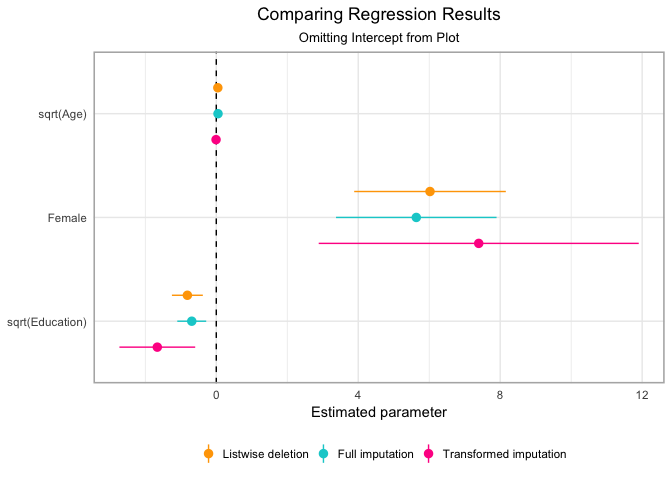

By comparing the parameter estimates across the different methods, we can see that the confidence intervals for the parameters overlap. This suggests that there may be little substantive or statistically significant difference among methods. Notably, the transformed parameters for female and education aremuch wider than those for listwise deletion or full imputation.
